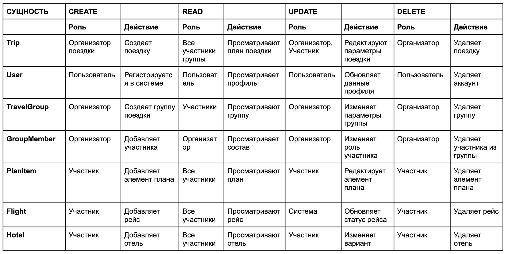
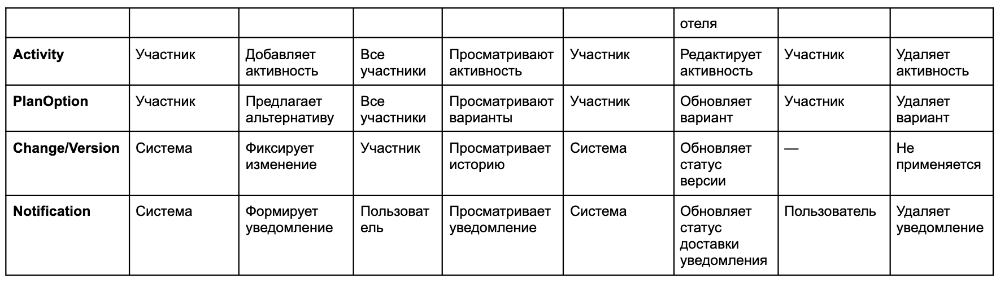
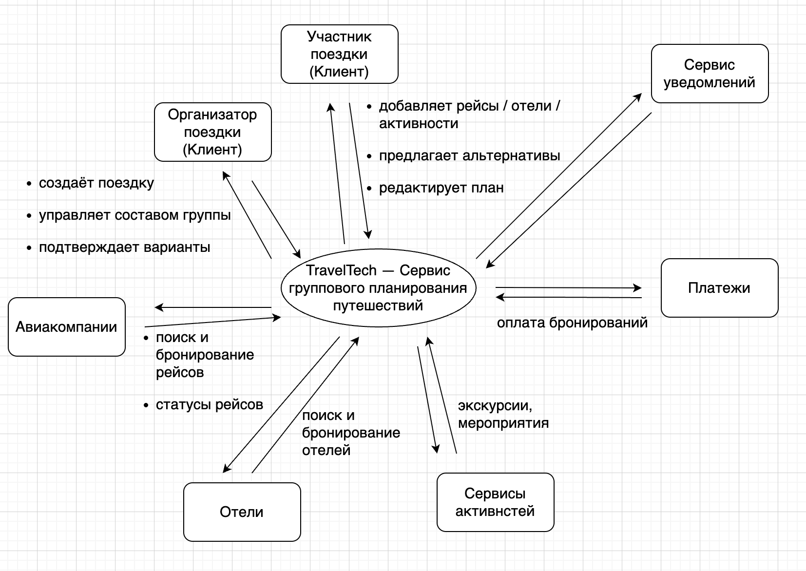
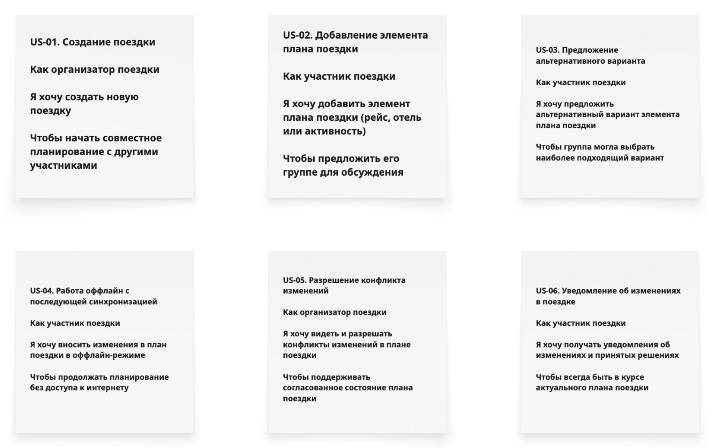
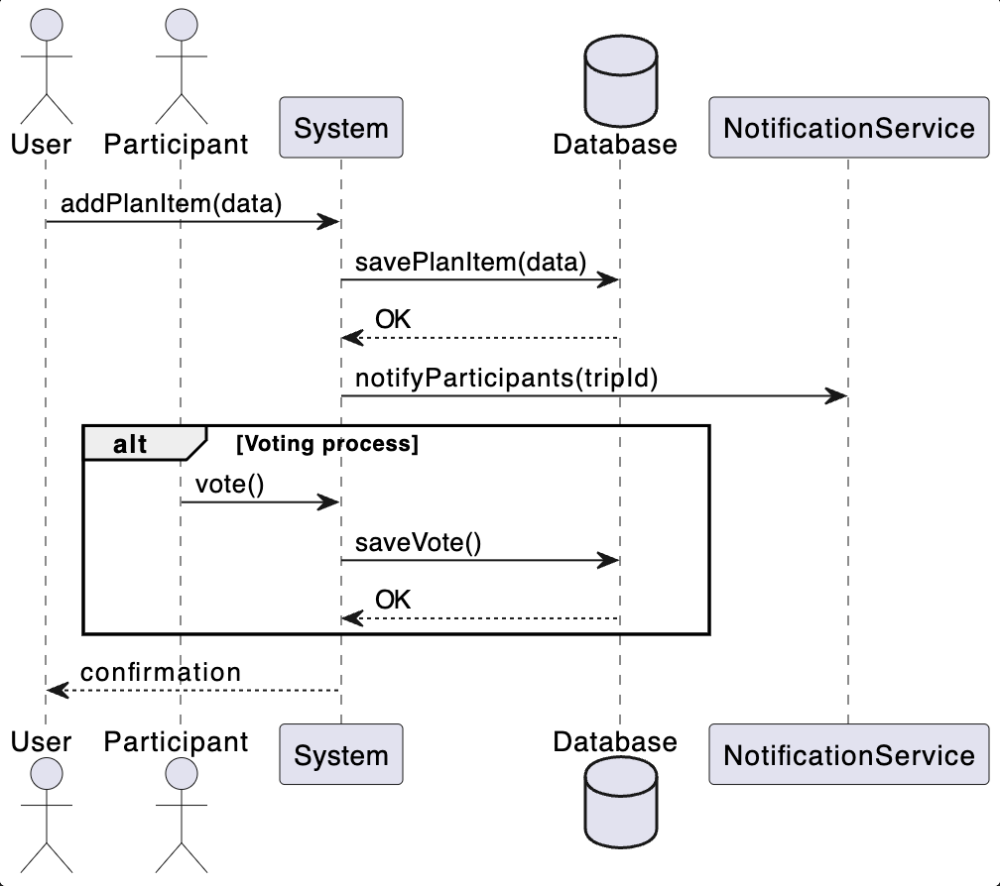
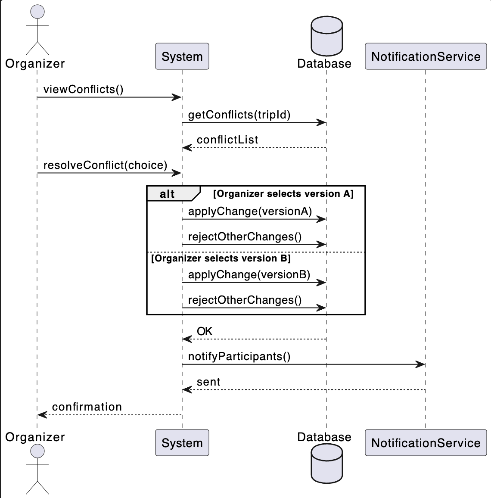

# TravelTech - система для совместного планирования поездок с голосованием, предложением альтернатив и разрешением конфликтов.

---

## Описание: Сервис позволяет пользователю спланировать поездку: подобрать билеты, отели, трансферы, активности. Все бронирования синхронизируются в едином интерфейсе, система выдаёт рекомендации на основе интересов и истории.

---

## Бизнес-цели

- Повышение вовлеченности пользователей при совместном планировании
- Снижение конфликтов изменений на 80%
- Обеспечение синхронизации данных в реальном времени
- Увеличение конверсии в бронирование

---

## Предметная область 

---

---

## Стейкхолдеры и их нужды

---

Ниже представлен каталог заинтересованных сторон проекта, их ролей, целей и зон ответственности.

---

| Категория              | Роль в проекте            | Описание роли                      | Цели / задачи                              | Зоны ответственности / действия                       |
|------------------------|---------------------------|------------------------------------|--------------------------------------------|------------------------------------------------------|
| **Бизнес-стейкхолдеры** | Заказчик / Бизнес-владелец | Владелец продукта TravelTech       | Рост метрик, ценность для пользователей   | Видение продукта, приоритизация требований          |
|                        | Клиент-менеджер           | Представитель бизнеса, точка контакта | Донести бизнес-требования до команды      | Сбор и согласование требований                       |
| **Пользователи**       | Конечный пользователь     | Участник групповой поездки         | Совместно спланировать поездку            | Добавление, редактирование, выбор вариантов         |
|                        | Организатор поездки       | Ответственный за итоговый план     | Принятие финальных решений                 | Подтверждение / отклонение вариантов                |
| **Команда разработки** | Системный аналитик        | Формализует требования             | Корректная модель данных и процессов       | Требования, сценарии, модели, спецификации         |
|                        | Backend-разработчик       | Реализует серверную часть          | Надёжная синхронизация данных             | API, бизнес-логика, merge-стратегии                |
|                        | Frontend-разработчик      | Реализует клиентские интерфейсы    | Удобный UX совместного планирования       | UI, оффлайн-режим, уведомления                      |
|                        | Mobile-разработчик        | Мобильные клиенты                  | Работа оффлайн, синхронизация             | Кеширование, локальные изменения                    |
|                        | QA-инженер                | Проверка качества                  | Стабильность и корректность               | Тестирование конфликтов и оффлайн-сценариев        |
| **Технические роли**   | DevOps-инженер            | Инфраструктура и надёжность        | Высокая доступность сервиса               | Мониторинг, отказоустойчивость                      |
|                        | Специалист по безопасности | Защита данных                       | Соответствие требованиям безопасности      | Персональные и платёжные данные                     |
| **Внешние участники**  | Поставщики API            | Источники данных                    | Предоставление актуальной информации      | Расписания, цены, статусы                            |
|                        | Платёжные провайдеры      | Обработка платежей                  | Безопасные транзакции                      | Авторизация и подтверждение платежей               |
| **Эксплуатация**       | Служба поддержки          | Поддержка пользователей            | Быстрое решение проблем                    | Анализ логов, история изменений                    |

Ниже приведён анализ заинтересованных сторон проекта, их интересов, потребностей и возможных проблем. Это помогает понять, кто и зачем взаимодействует с системой, а также какие риски стоит учитывать.

---

| Стейкхолдер                     | Интересы / цели                                | Потребности                                      | Возможные проблемы / риски                                   |
|---------------------------------|------------------------------------------------|-------------------------------------------------|-------------------------------------------------------------|
| Заказчик / Бизнес-владелец       | Рост выручки, удержание пользователей, масштабируемость сервиса | Прозрачная модель совместного планирования, надёжная система синхронизации | Потеря данных из-за конфликтов, негативный пользовательский опыт |
| Клиент-менеджер                  | Успешная реализация проекта, удовлетворённость заказчика | Чётко сформулированные и согласованные требования | Неоднозначные ожидания, частые изменения требований         |
| Конечный пользователь (участник поездки) | Удобное совместное планирование               | Актуальный план поездки, предложения альтернатив | Конфликты правок, потеря изменений, непонимание итогового состояния |
| Организатор поездки              | Контроль и финальное решение                   | Инструменты выбора и подтверждения вариантов    | Избыточное количество предложений, сложность принятия решения |
| Системный аналитик               | Корректная постановка требований              | Понимание бизнес-процессов и ограничений       | Неполные требования, противоречия между стейкхолдерами      |
| Backend-разработчик              | Стабильная и масштабируемая архитектура       | Чёткие API-контракты, понятные merge-стратегии | Сложные сценарии конфликтов и оффлайн-синхронизации         |
| Frontend-разработчик             | Удобный и понятный UX                          | Предсказуемое состояние данных                  | Сложность отображения конфликтов и альтернатив             |
| Mobile-разработчик               | Корректная работа оффлайн                       | Локальное хранилище и синхронизация             | Конфликты данных при восстановлении соединения             |
| QA-инженер                       | Качество и стабильность системы               | Чёткие сценарии и требования                    | Трудно воспроизводимые ошибки синхронизации                |
| DevOps-инженер                   | Надёжность и доступность                       | Мониторинг, отказоустойчивость                  | Зависимость от внешних API                                  |
| Специалист по безопасности       | Защита данных                                  | Контроль доступа, шифрование                    | Утечки персональных и платёжных данных                     |
| Служба поддержки                  | Быстрое решение инцидентов                     | История изменений и логирование                 | Отсутствие прозрачного аудита изменений                     |
| Поставщики внешних API            | Стабильная интеграция                          | Корректные запросы и лимиты                      | Перегрузка API, некорректная обработка ошибок              |
| Платёжные провайдеры             | Безопасные транзакции                           | Корректная интеграция                             | Повторные списания, несогласованность статусов             |

## Roles and Actions (AS IS → TO BE)

---

Ниже представлена таблица ролей и действий пользователей и системы. Она показывает текущие (AS IS) сценарии работы онлайн и оффлайн, выявленные проблемы, а также предлагаемые решения (TO BE) в проектируемой системе.  

Эта таблица демонстрирует подход к анализу бизнес-процессов и проектированию функционала системы с учетом конфликтов данных, синхронизации и работы оффлайн.

---

| ID    | Стейкхолдер           | Действие                     | AS IS онлайн | AS IS оффлайн | Проблемы                          | TO BE в системе                 | Решение проблемы                       |
|-------|----------------------|-------------------------------|--------------|---------------|----------------------------------|--------------------------------|---------------------------------------|
| st001 | Клиент (организатор)  | Создание поездки              | +            | -             | Без интернета план недоступен    | +                              | Хранение состояния поездки на сервере |
| st002 | Клиент (участник)     | Добавление рейса              | +/-          | -             | Другие участники не сразу видят изменения | +                      | Событийная синхронизация               |
| st003 | Клиент (участник)     | Добавление отеля              | +/-          | -             | Возможен конфликт с рейсами     | +                              | Проверка конфликтов по времени         |
| st004 | Клиент (участник)     | Добавление активности         | +/-          | -             | Пересечения с другими элементами | +                              | Валидация таймлайна поездки            |
| st005 | Клиент (участник)     | Предложение альтернативы      | -            | -             | Нет механизма вариантов          | +                              | Сущность Proposal                       |
| st006 | Клиент (участник)     | Параллельное редактирование   | -            | -             | Потеря изменений                 | +                              | Версионирование и merge                 |
| st007 | Клиент (участник)     | Удаление элемента             | +/-          | -             | Удаления не прозрачны            | +                              | Лог изменений + уведомления             |
| st008 | Клиент (участник)     | Работа оффлайн                | -            | +             | Изменения не синхронизируются   | +                              | Локальный кэш + отложенная синхронизация |
| st009 | Клиент                | Просмотр актуального плана    | +/-          | -             | Неясно, какая версия актуальна   | +                              | Единый источник истины                  |
| st010 | Система               | Обработка конфликтов          | -            | -             | Конфликты не выявляются          | +                              | Merge-стратегии                         |
| st011 | Система               | Учет тайм-зон                 | +/-          | -             | Ошибки во времени                | +                              | Хранение времени в UTC                  |

---

## DFD

---

Диаграмма потоков данных отражает движение информации между пользователями, системой и внешними API.

---

---

## Context Diagram

---

---

## BPMN диаграмма процессов

---

BPMN демонстрирует процесс совместного редактирования и разрешения конфликтов в модели TO BE.

---

---
<!-- Если есть несколько процессов, можно сделать отдельный подзаголовок для каждого (## BPMN: Создание задачи, ## BPMN: Обновление статуса). -->

## User Stories
---

---

## Use Case

Ниже представлены формализованные Use Cases, детализирующие ключевые User Stories проекта.

---

### US-02 — Добавление элемента плана поездки

| **Поле** | **Описание** |
|-----------|--------------|
| **Акторы** | Пользователь (участник группы поездки) |
| **Предусловия** | • Пользователь добавлен в группу • Поездка создана и доступна для редактирования |
| **Ограничения** | • Отсутствие подключения к интернету |
| **Триггер** | Пользователь нажимает кнопку «Внести изменения» |
| **Основной сценарий** | 1. Открытие экрана редактирования поездки. 2. Отображение текущего плана. 3. Выбор «Добавить элемент плана». 4. Отображение формы добавления. 5. Выбор типа элемента. 6. Заполнение данных. 7. Нажатие «Сохранить». 8. Валидация данных. 9. Сохранение элемента. 10. Отправка уведомлений участникам. 11. Открытие возможности голосования. |
| **Альтернативные сценарии** | **A1. Отмена добавления** — форма закрывается, изменения не сохраняются.  **A2. Нет подключения к интернету** — вывод уведомления или локальное сохранение (если поддерживается). |
| **Результат** | • Новый элемент добавлен. • Участники уведомлены. • Доступно голосование. |

---

### US-03 — Предложение альтернативного варианта элемента плана

| **Поле** | **Описание** |
|-----------|--------------|
| **Акторы** | Пользователь (участник группы поездки) |
| **Предусловия** | • Пользователь добавлен в группу • Поездка создана и доступна для редактирования • Существует элемент плана для предложения альтернативы |
| **Ограничения** | • Отсутствие подключения к интернету |
| **Триггер** | Пользователь нажимает «Предложить альтернативу» |
| **Основной сценарий** | 1. Открытие экрана редактирования. 2. Отображение плана поездки. 3. Выбор элемента плана. 4. Выбор «Предложить альтернативный вариант». 5. Отображение формы. 6. Заполнение данных. 7. Нажатие «Сохранить». 8. Сохранение альтернативного варианта. 9. Отправка уведомлений. 10. Запуск голосования. 11. Подтверждение выбранного варианта по результатам голосования. |
| **Альтернативные сценарии** | **A1. Отмена добавления альтернативы** — изменения не сохраняются.  **A2. Нет подключения к интернету** — уведомление или локальное сохранение (если предусмотрено). |
| **Результат** | • Альтернативный вариант сохранён. • Участники уведомлены. • По результатам голосования выбран итоговый вариант. |

---

### US-05 — Разрешение конфликта изменений

| **Поле** | **Описание** |
|-----------|--------------|
| **Акторы** | Организатор (участник группы поездки) |
| **Предусловия** | • Поездка создана и активна • Организатор является участником группы • В системе зафиксированы конфликтующие изменения |
| **Ограничения** | • Отсутствие подключения к интернету • Конфликт может быть разрешён только организатором |
| **Триггер** | Система фиксирует конфликт и уведомляет организатора |
| **Основной сценарий** | 1. Организатор открывает план поездки. 2. Система отображает уведомление о конфликте. 3. Переход в режим просмотра конфликтов. 4. Отображение списка конфликтующих изменений. 5. Выбор конфликтующего элемента. 6. Отображение деталей версий (автор, время, содержание). 7. Выбор действия: принять / отклонить / объединить. 8. Подтверждение решения. 9. Сохранение согласованной версии. 10. Обновление плана поездки. 11. Уведомление участников о разрешении конфликта. |
| **Альтернативные сценарии** | **A1. Отмена разрешения конфликта** — конфликт остаётся в статусе «не разрешён».  **A2. Нет подключения к интернету** — уведомление, локальное сохранение решения (если поддерживается), синхронизация при восстановлении соединения. |
| **Результат** | • Конфликт разрешён или отложен. • План поездки приведён в согласованное состояние. • Участники уведомлены о принятом решении. |

## UML

---

UML-диаграммы отражают структурную и поведенческую модель системы, необходимую для реализации механизмов версионирования и разрешения конфликтов.

---

### Диаграмма классов

---

### Sequence diagrams

